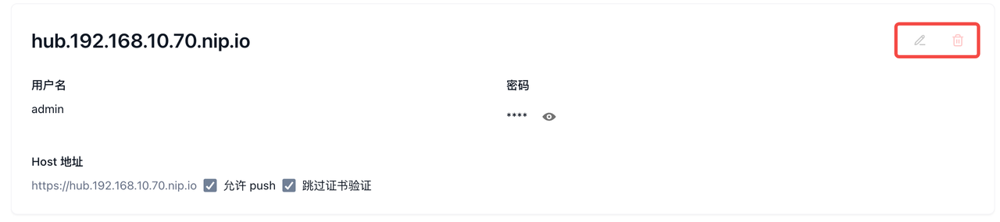
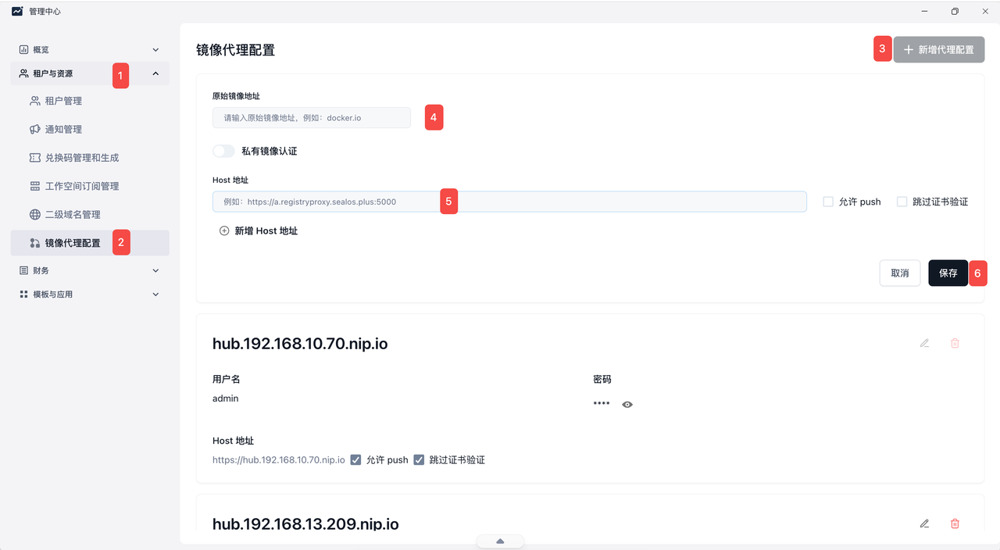
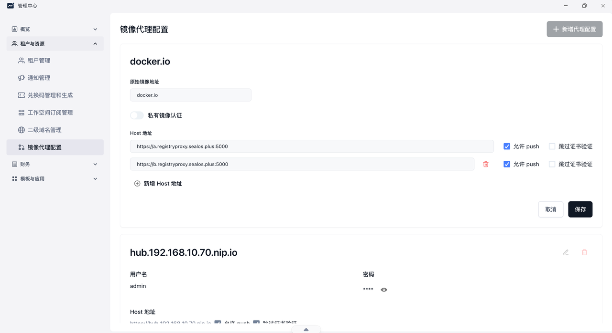
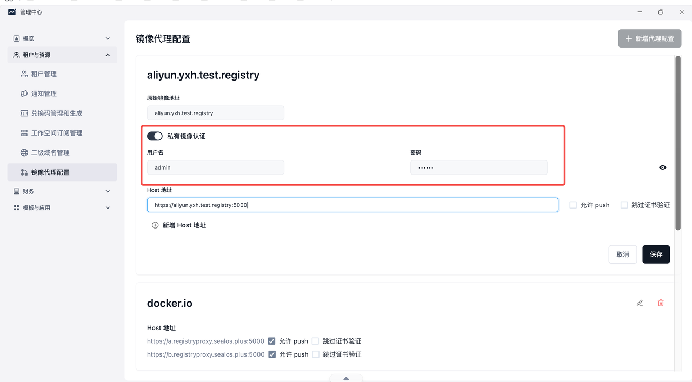

## 升级备忘

如果无法使用，需要部署registry。但是**切记不要和原有的配置冲突**。可以换个ns进行部署。

[registry-0.1.26.tgz](/docs/self-hosting/files/registry-0.1.26.tgz)

```bash
helm upgrade -i registry-sync ./registry-0.1.26.tgz -n registry-system  --create-namespace
```

## 备选措施

因sealos-system下的registry-proxy未正常部署，可直接执行以下命令

```bash
cat << EOF | kubectl create -f -
apiVersion: v1
kind: ConfigMap
metadata:
  name: registry-proxy
  namespace: sealos-system
data:
EOF
```

## 概念须知

* pull：是否代理/允许**拉取镜像  **- 能不能下 **（默认包含）**

* resolve：是否代理**镜像名解析 / 元数据解析 **- 能不能查“这个镜像实际指向什么”  **（默认包含）**

* push：是否代理/允许**推送镜像 **- 能不能传

* 跳过证书验证：指访问上游仓库或代理仓库时，**不校验 TLS/HTTPS 证书 **- HTTPS 证书报错时也硬连，但不安全

* 注意：

  hub.域名的配置是默认配置不可修改



## 操作详情

`新增镜像代理`步骤如图，只需将各个配置填写清楚即可。



## 示例

### 公有镜像

如图以`docker.io`的代理为例

1. 配置好请求的地址并且保存，即可去应用管理尝试拉取该代理的镜像。



### 私有镜像

1. 如图只需打开`私有镜像认证`的按钮

2. 根据私有仓库配置填入即可


