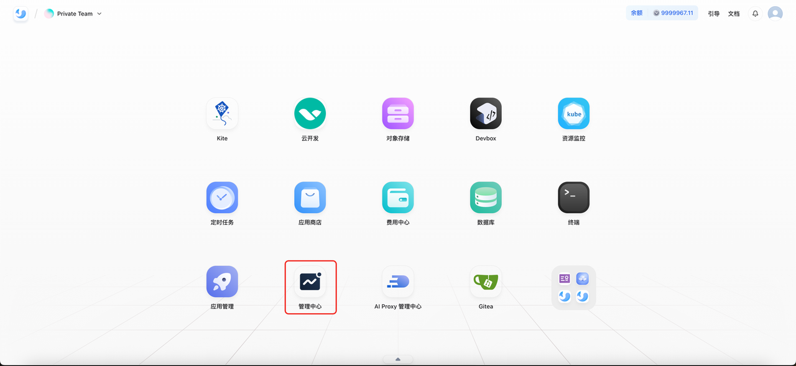
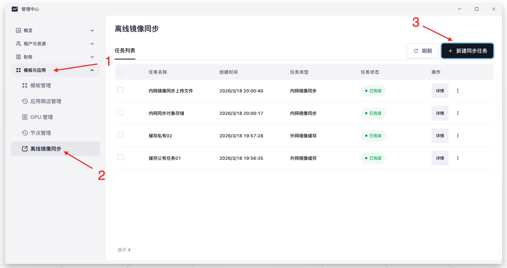
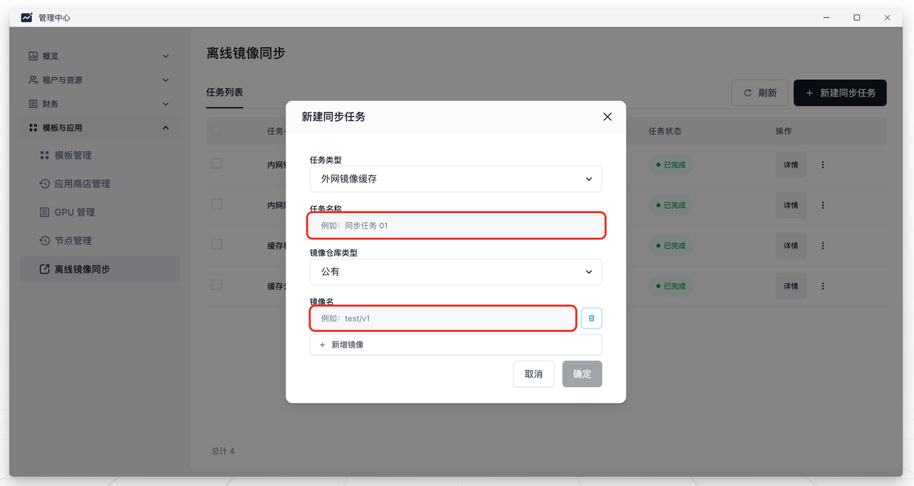
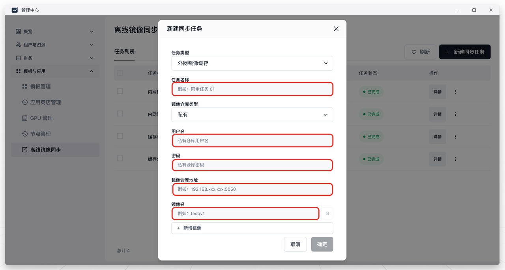
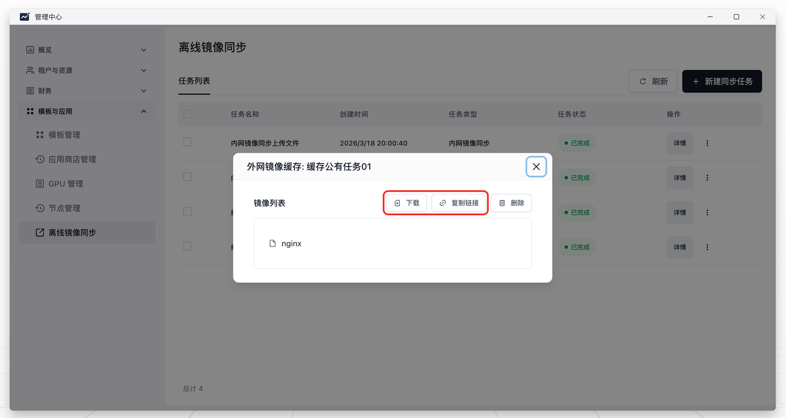
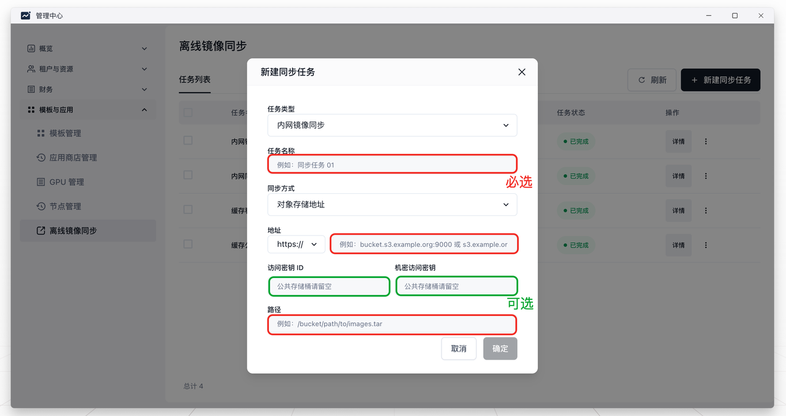
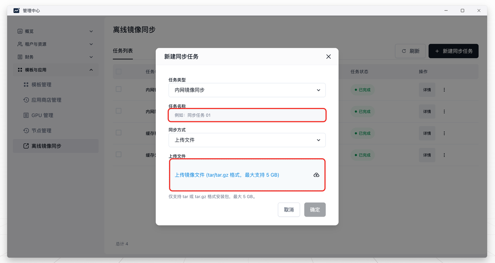

### 一、目的

为了解决集群间的镜像迁移问题，比如从一个在线环境迁移镜像到离线环境，这时就需要用到镜像同步功能。

### 二、步骤

首先点击主页的`管理中心`应用，从左侧的菜单中找到`模版与应用`，选择`离线镜像同步`，点击`新建同步任务`

在弹出的对话框中选择`任务类型`，有两种不同的类型：

1. **外网镜像缓存：**指的是从镜像来源处缓存镜像tar包，缓存后镜像会存放在存储桶中，也可以选择下载到本地

2. **内网镜像同步：**指的是从本地或存储桶中下载镜像到集群，同步后镜像可以在`应用管理`中部署

#### 1. 外网镜像缓存

选择外网镜像缓存后，需要填写任务名称，选择镜像仓库类型，如果选择`公有镜像仓库`，只需要填入需要拉取的公有仓库`镜像名`（可多填）后便可创建任务；如果选择`私有镜像仓库`，还需要私有镜像仓库的`用户名`、`密码`、`镜像仓库地址`信息才可创建任务。

创建之后任务会列举在任务列表中，这时任务在后台执行并显示执行中，等待任务完成之后，点击详情，可以选择`下载`或`复制下载地址`。

#### 2. 内网镜像同步

选择内网镜像同步后，需要填写任务名称，选择同步的方式，目前支持的有`对象存储`导入和`本地上传`两种方式，如果选择`对象存储`方式，需要根据对象存储中镜像的下载地址，区分 https/http 协议，将域名（端口号）填入地址输入框中，将存储桶中的镜像路径填入路径输入框中，如果使用的是公有存储桶地址，那么可忽略访问密钥（AK/SK）的填写，如果使用的是私有存储桶地址，则还需填写私有存储桶的访问密钥信息方可成功同步；如果选择`本地上传`方式，点击文件上传提示框后选择本地的 tar/tar.gz 文件，选择之后等待上传到存储中，再点击确认开始同步。

同步任务创建后会列举在任务列表中，任务状态处于执行中，等待任务完成后，即可在应用管理中部署该镜像。
