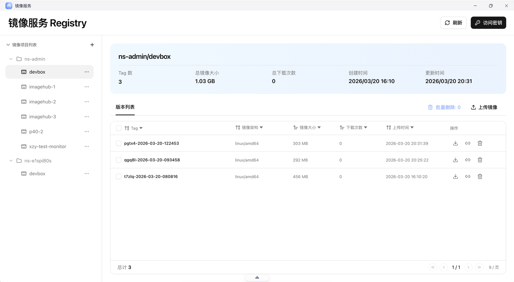
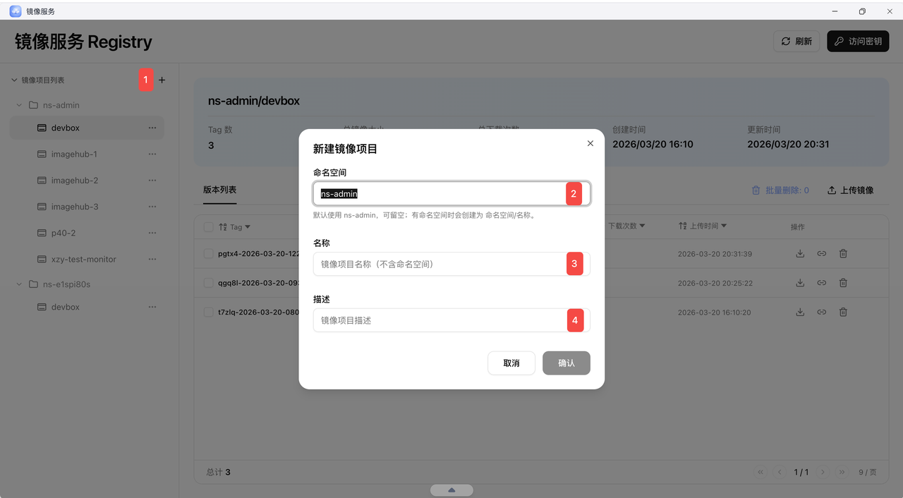
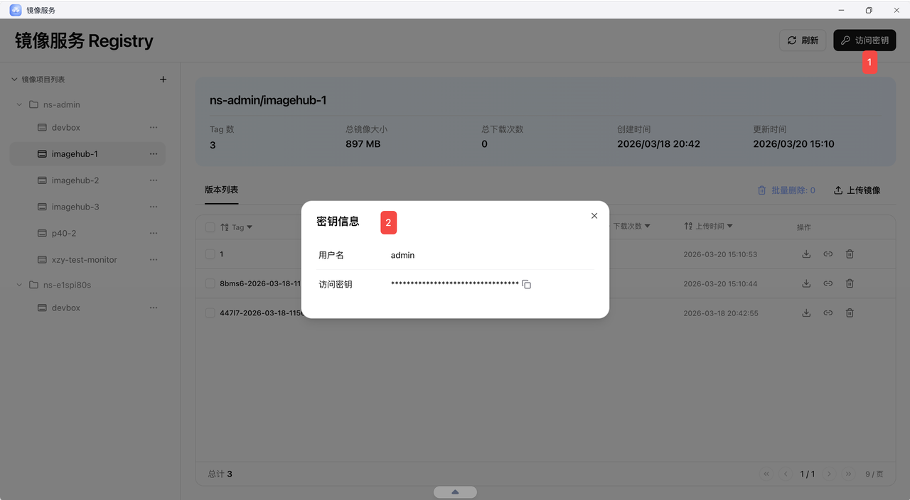
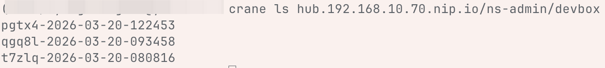
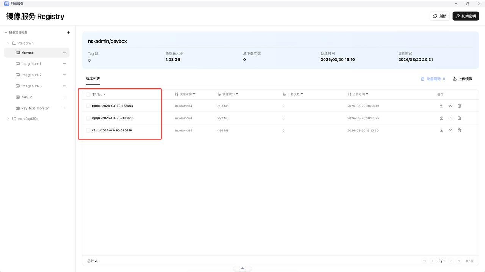
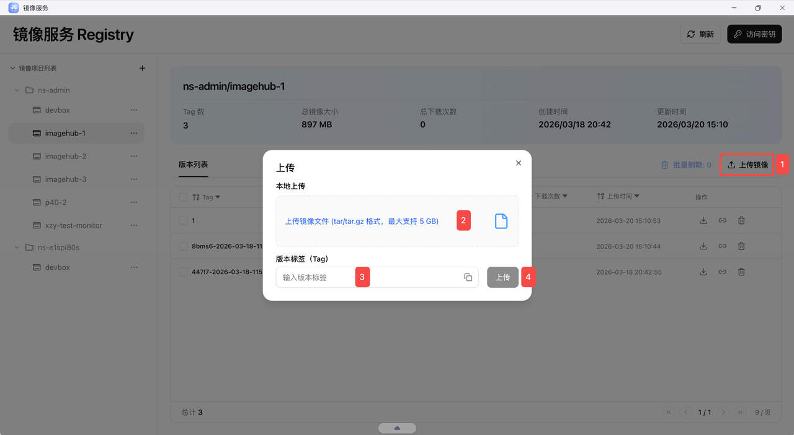
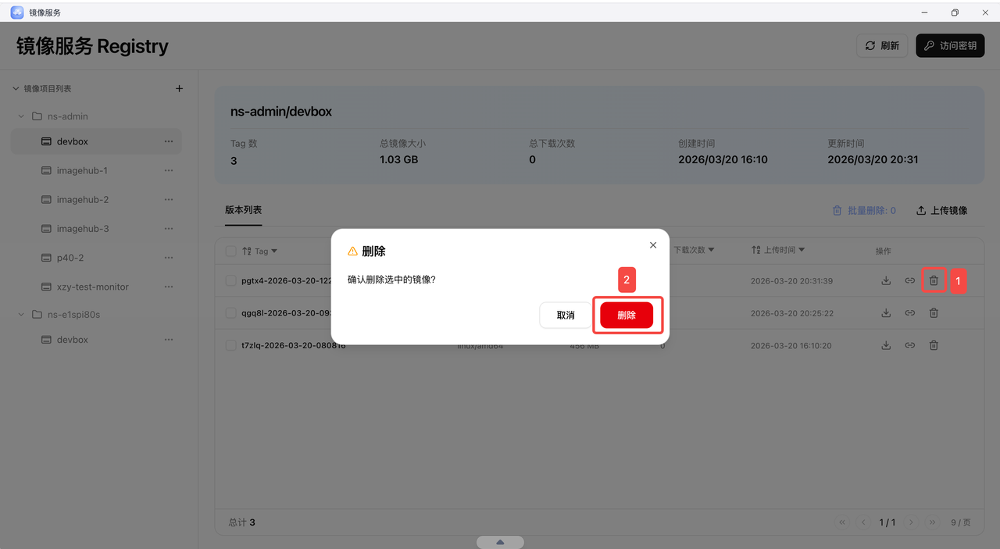
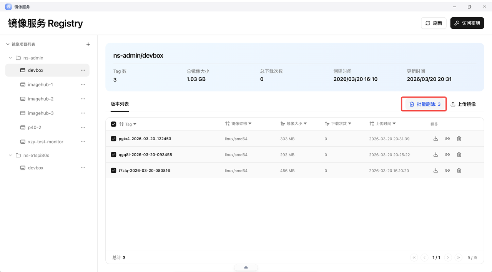

## 应用说明

`镜像服务`应用中会记录集群内所有DevBox的镜像更迭。（Admin专属）
注意：DevBox的命名一致时，工作空间内的所有DevBox镜像都记录在一个项目内。



## 操作说明

### 1. 新增

如图

* 命名空间 - 项目的一级目录，一般为工作空间ID 即ns-xxxx（默认为`ns-admin`）

* 名称 - DevBox名

* 描述 - 对于项目的描述



### 2. Registry配置

如图，进入访问密钥后，可以直接在本地连入Registry。

#### 2.1 获取仓库配置信息

密钥以秘文形式展示，只可点击`复制按钮`复制



#### 2.2 本地配置示例

如下我是使用crane工具直接在本地登录仓库。仓库：`hub.域名`，如域名为192.168.10.70.nip.io，
仓库名：`hub.192.168.10.70.nip.io`

```bash
crane auth login -u 用户名 -p 访问密钥 仓库名
```





##### Docker

1. 为镜像打上目标仓库的标签

```bash
docker tag test-image:1 hub.192.168.10.70.nip.io/ns-admin/test-image:1
```

* 推送镜像

```bash
docker push hub.192.168.10.70.nip.io/ns-admin/test-image:1
```

##### Crane

1. 导出本地镜像为 tar 文件

```bash
docker save test-image:1 -o test-image.tar
```

* 使用 crane 推送 tar 文件到仓库

```bash
crane push test-image.tar hub.192.168.10.70.nip.io/ns-admin/test-image:2
```

### 3. 上传本地镜像

如图，上传镜像可兼容OCI镜像的 `tar/tar.gz`包

版本Tag，重复会直接覆盖



### 4. 删除

* 支持单镜像删除



* 支持批量删除


