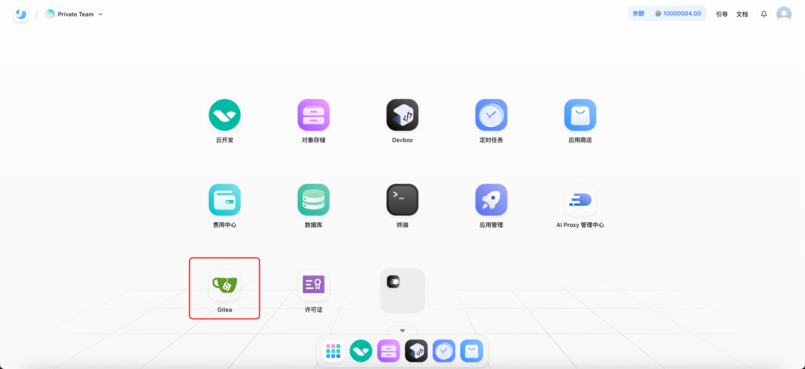
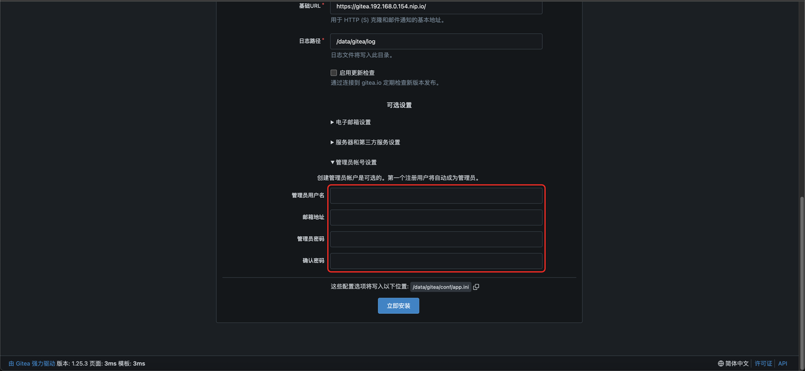
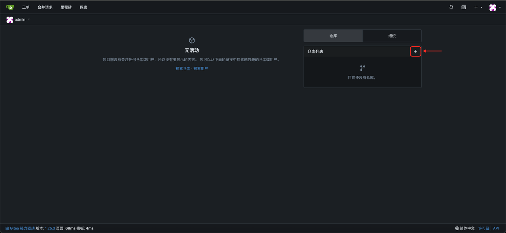
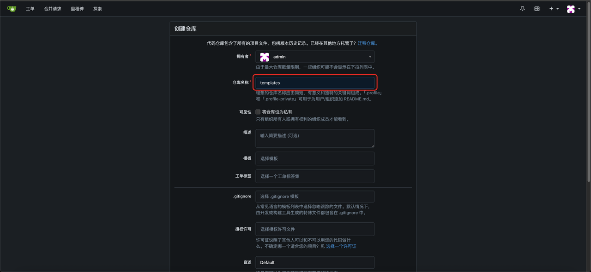
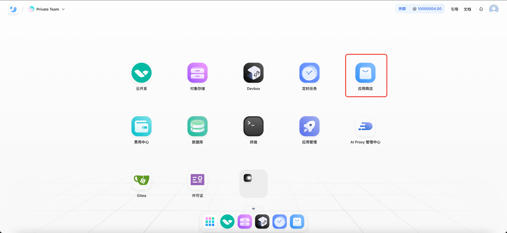
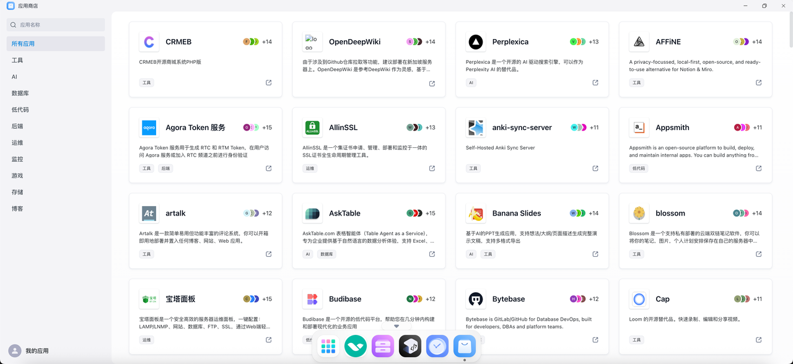
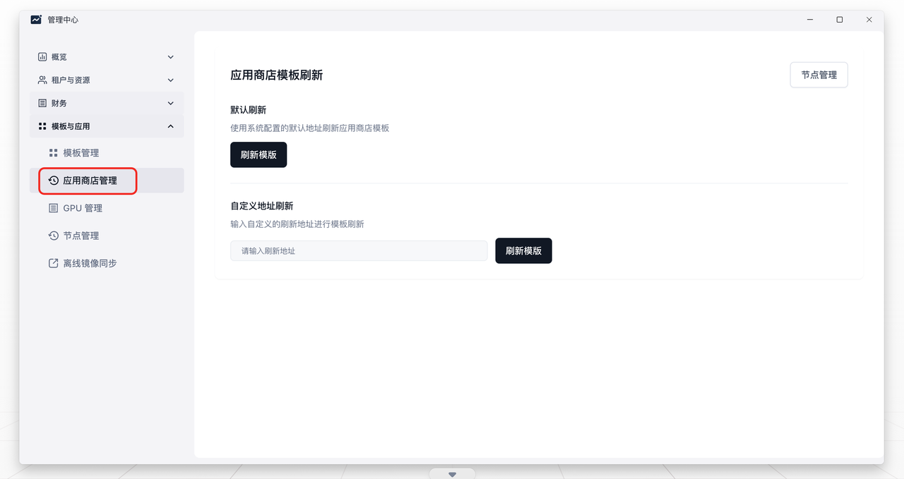

### 前置条件

集群部署前需要配置 `sealos.env` 中的 `SEALOS_V2_FEATURE` 参数，开启 `gitea_template`。


### 导入模板

1. 安装完成后 Sealos 主页会有 Gitea 应用。



* 打开主页的 Gitea 应用，第一次打开需要创建 admin 账号，用户名填写 `admin`。



* 进入后创建一个名为 `templates` 的代码仓库。





* 将准备好的 templates 代码 push 到 Gitea 仓库，`<domain>` 替换为实际的地址，执行下面的命令：

```bash
git clone templates.bundle templates -b main
cd templates/
git remote set-url origin http://gitea.<domain>/admin/templates.git
git push origin main
```

* 执行成功后返回 Sealos 主页，打开应用商店，等待加载模板即可。





### 更新模板

后续如果模板仓库有更新需要更新应用商店时，点击进入 Sealos 主页的 `管理中心` 应用，选择 `模板与应用` 下的 `应用商店管理`



其中分为 **默认刷新** 和 **自定义地址刷新：**

* **默认刷新：**使用系统配置的默认地址刷新应用商店模板，默认为 `http://gitea.<domain>/admin/templates.git`

* **自定义地址刷新：**输入自定义模板地址进行刷新
