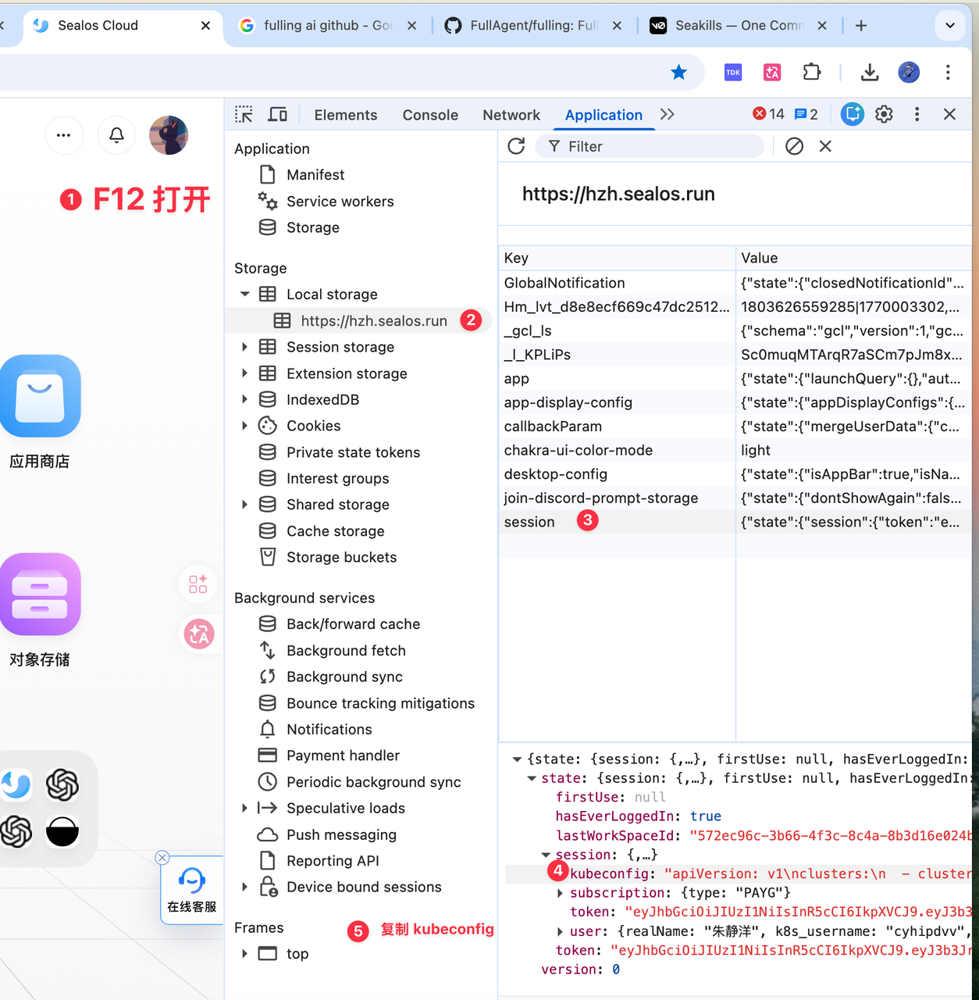

## 获取 sealos 认证（kubeconfig）

### 方法 1  浏览器调试获取 kubeconfig

已经成功登录的账户，通过 `F12` 打开调试面板，切换到 **应用**（Application）选项卡，找到 **本地存储**（Local Storage）下的主站登录信息，找到 **session** 信息，拷贝其中的 kubeconfig 信息。



* 后续接口使用，**URL 编码**之后的 kubeconfig ，作为 Authorization 即可（encodeURIComponent）

### 方法 2  Sealos Auth API

请参考 [Sealos Auth API 引导](/docs/self-hosting/apps-api/auth-api-guide)

## 应用商店 API

### 请求示例

```bash
curl -X POST 'https://template.<sealos-domain>/api/v1alpha/applyNodePort' \
  -H 'Content-Type: application/json' \
  -H 'Authorization: <kubeconfig>' \
  -d '{
    "name": "my-app",                   // 应用名称
    "template": "my-app-template",      // 模板名称
    "args": {
      "APP_DOMAIN": "example.com"       // 可选参数
    },
    "type": "create"
  }'
```

* `<sealos-domain>` 替换为实际 Sealos 主域名,比如 [192.168.10.70.nip.io](https://template.192.168.10.70.nip.io/)

* `<kubeconfig>` 替换为 URL 编码后的 kubeconfig，通过上面方式获取

```bash
curl -X POST 'https://template.<sealos-domain>/api/v1alpha/applyNodePort' \
-H 'Content-Type: application/json' \
-H 'Authorization: <kubeconfig>' \
-d '{
  "yamlList":[
    "apiVersion: app.sealos.io/v1\nkind: Instance\nmetadata:\n  name: my-app\nspec:\n  title: My App\n  url: https://my-app.example.com\n  gitRepo: https://github.com/example/my-app",
    "apiVersion: v1\nkind: Service\nmetadata:\n  name: my-svc\nspec:\n  ports:\n    - port: 8080\n  selector:\n    app: my-app",
    "apiVersion: networking.k8s.io/v1\nkind: Ingress\nmetadata:\n  name: my-ingress\nspec:\n  rules:\n    - host: my-app.example.com\n      http:\n        paths:\n          - path: /\n            pathType: Prefix\n            backend:\n              service:\n                name: my-svc\n                port:\n                  number: 8080"
  ],
  "type":"create"
}'
```

### API 解释

`POST /api/v1alpha/applyNodePort`

#### 概述

将模板以 `NodePort` 模式部署到 Kubernetes 集群。

该接口会在部署过程中自动处理 `Ingress` 资源：

* 将 `Ingress` 转换为 `NodePort Service`

* 将 YAML 中基于域名的访问地址替换为 `http://<nodeIP>:<nodePort>`

适用于未安装 `Ingress Controller` 的私有化部署场景。

#### 认证

请求头中需携带 `kubeconfig` 用于鉴权。

#### 请求

##### 请求头

| 名称             | 是否必填 | 说明                     |
| -------------- | ---- | ---------------------- |
| `Content-Type` | 是    | 固定为 `application/json` |
| `kubeconfig`   | 是    | Kubernetes 集群访问凭证      |

##### 请求体

支持以下两种模式，二选一：

* 模式 A：直接传入预渲染后的 YAML

* 模式 B：由服务端根据模板进行渲染

***

##### 模式 A：预渲染 YAML 部署

###### 请求字段

| 字段名        | 类型                      | 是否必填 | 默认值        | 说明                    |
| ---------- | ----------------------- | ---- | ---------- | --------------------- |
| `yamlList` | `string[]`              | 是    | -          | Kubernetes YAML 字符串数组 |
| `type`     | `"create" \| "replace"` | 否    | `"create"` | 资源应用方式                |

###### 请求示例

```json
{
  "yamlList": [
    "apiVersion: v1\nkind: Service\nmetadata:\n  name: my-svc\n...",
    "apiVersion: networking.k8s.io/v1\nkind: Ingress\n..."
  ],
  "type": "create"
}
```

***

##### 模式 B：服务端模板渲染部署

###### 请求字段

| 字段名        | 类型                       | 是否必填 | 默认值        | 说明             |
| ---------- | ------------------------ | ---- | ---------- | -------------- |
| `name`     | `string`                 | 是    | -          | 应用名称           |
| `template` | `string`                 | 是    | -          | 模板名称           |
| `args`     | `Record<string, string>` | 否    | `{}`       | 模板变量，用于覆盖模板默认值 |
| `type`     | `"create" \| "replace"`  | 否    | `"create"` | 资源应用方式         |

###### 请求示例

```json
{
  "name": "my-app",
  "template": "my-app-template",
  "args": {
    "APP_DOMAIN": "example.com",
    "REPLICAS": "3"
  },
  "type": "create"
}
```

#### 响应

##### 成功响应

###### `200 OK`

```json
{
  "code": 200,
  "message": "Success",
  "data": {
    "uid":"04bfde13-001d-4663-9cfa-40e6c4c40954",
    "appliedKinds": ["Instance", "Service", "Deployment", "ConfigMap"],
    "nodePortMap": {
      "my-svc": 31234,
      "my-api": 31567
    },
    "externalURLs": {
      "app.example.com": "http://192.168.1.10:31234",
      "api.example.com": "http://192.168.1.10:31567"
    }
  }
}
```

###### 响应字段说明

| 字段路径                | 类型                       | 说明                             |
| ------------------- | ------------------------ | ------------------------------ |
| `code`              | `number`                 | 业务状态码                          |
| `data`              | `object`                 | 响应数据                           |
| `data.appliedKinds` | `string[]`               | 已成功部署的资源 Kind 列表               |
| `data.nodePortMap`  | `Record<string, number>` | `Service` 名称到 `NodePort` 端口的映射 |
| `data.externalURLs` | `Record<string, string>` | 原始域名到最终可访问地址的映射                |

##### 回退行为

当输入 YAML 中不包含 `Ingress` 资源时，接口会回退为标准部署模式，不执行 `Ingress -> NodePort` 转换。此时：

* `data.nodePortMap` 返回空对象

* `data.externalURLs` 返回空对象

#### 错误码

| HTTP 状态码 | 错误码   | 场景说明                                   |
| -------- | ----- | -------------------------------------- |
| `400`    | `400` | 请求体中同时缺少 `yamlList` 和 `templateName`   |
| `401`    | `401` | 鉴权失败                                   |
| `500`    | `500` | `SEALOS_NODE_IP` 未配置，或 Kubernetes 调用失败 |

##### 错误响应示例

```json
{
  "code": 500,
  "error": "SEALOS_NODE_IP not configured"
}
```

#### 处理逻辑说明

接口处理流程如下：

1. 校验请求头中的 `kubeconfig`

2. 根据请求内容选择 YAML 直传模式或模板渲染模式

3) 检测资源中是否包含 `Ingress`

4) 如包含 `Ingress`，则自动转换为 `NodePort Service`

5. 将域名访问地址替换为 `http://<nodeIP>:<nodePort>`

6. 将资源以 `create` 或 `replace` 模式应用到集群

7) 返回部署结果、端口映射关系及最终访问地址
