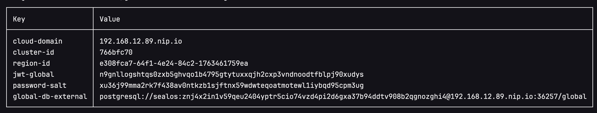
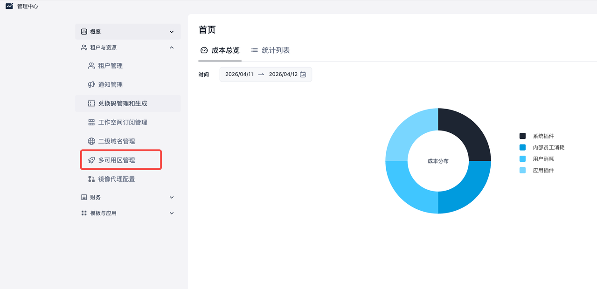
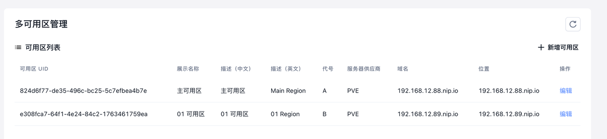

### 第一个可用区

参考  [Sealos 快速安装指南](/docs/self-hosting/installation/quick-install)

获取Region信息：

./bin/gen-info -show-region



clusterDomain: 当前集群的域名

clusterId: 集群ID（申请LICENSE使用）

regionID: 可用区ID （展示使用）

jwtGlobal: 全局Token

passwordSalt: 密码盐

globalDbExternal: 全局数据库

***

### 第N个可用区

填写values文件，vim \`/root/sealos-commercial-v5.1.2-rc5/values/global.yaml\`

```yaml
global:
  featureConfigs:
    database:
      type: cockroachdb
    regionInfo:
      jwtGlobal: "xxx"
      passwordSalt: "xxx"
    localDatabase:
      uri: ""
    globalDatabase:
      uri: "xxx"
```

把对应的字段改成第一个集群打印的信息

#### 安装集群

参考  [Sealos 快速安装指南](/docs/self-hosting/installation/quick-install)

***

### 维护可用区信息

#### 运行最新的admin组件（在第一个可用区）

```text
sealos run sealos-admin-cluster-latest-933c7cf-amd64.tar
```

#### 登录并维护可用区信息





**多可用信息会自动注册，需要自行修改对应的说明，切记域名不要改错。**

#### 修改所有desktop的配置

```text
kubectl edit cm -n sealos sealos-desktop-config

## 修改proxyDoamin为空
```

```json
apiVersion: v1
data:
  config.yaml: |
    cloud:
      ...
      proxyDomain: ""
```

```text
## 重启desktop信息
kubectl rollout restart deploy -n sealos sealos-desktop
```
