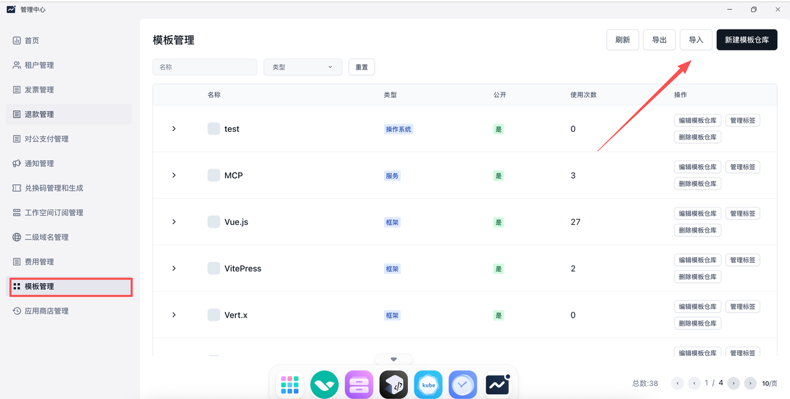
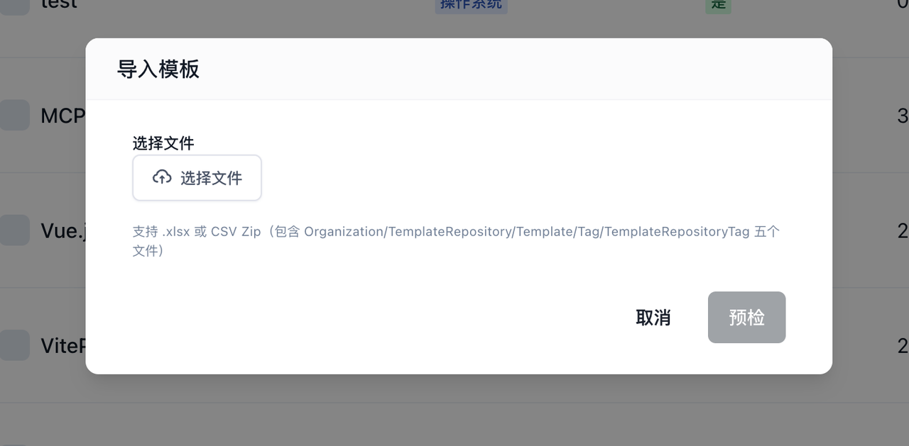

### 1. 在 master 上执行

```bash
sealos run devbox-cache-v1-cache-amd64.tar
sealos run devbox-cache-v1-cuda-cache-amd64.tar
sealos run devbox-cache-v1-arm64-cache-arm64.tar #这个是arm64架构才需要
```

### 2. 在每个 devbox 节点上执行

```bash
## /var/lib/sealos/data/default/rootfs/devbox-v1/devbox-worker-start.sh
cd /var/lib/sealos/data/default/rootfs/devbox-v1/ 
## 如果GPU需要做应用一般需要参数为false 如果需要独占则为true
bash devbox-worker-start.sh false
```

### 3. 在admin导入Excel,Excel 在离线包的etc目录存放





[devbox-amd.xlsx](/docs/self-hosting/files/devbox-amd.xlsx)

[devbox-amd-cuda.xlsx](/docs/self-hosting/files/devbox-amd-cuda.xlsx)

[devbox-arm.xlsx](/docs/self-hosting/files/devbox-arm.xlsx)
